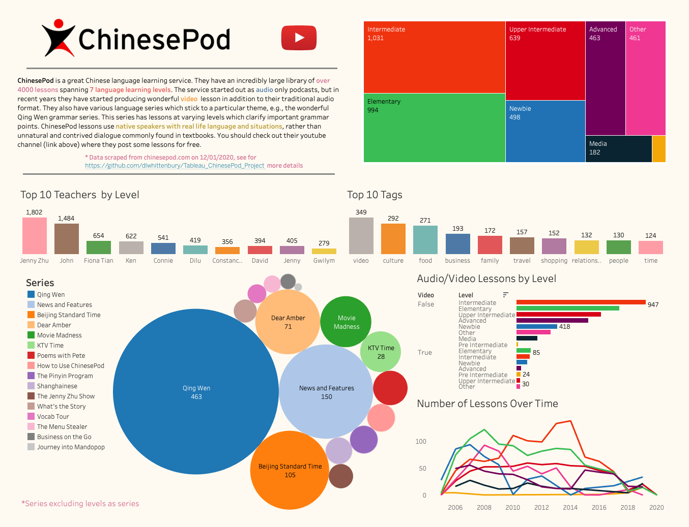

# ChinesePod Tableau Project

In this project I have used Tableau to make an interactive dashboard to
illustrate what ChinesePod has to offer. The data was scraped from the
ChinesePod website initially in the repository
[ChinesePod_Project](https://github.com/dlwhittenbury/ChinesePod_Project)
and then the data was normalised into tables in the repository
[SQLite_ChinesePod_Project](https://github.com/dlwhittenbury/SQLite_ChinesePod_Project).
This dashboard and others can be found on my Tableau Public profile which can be
found [here](https://public.tableau.com/profile/daniel.whittenbury#!/?newProfile=&activeTab=0).
Click on dashboard image below to interact with the dashboard. 

